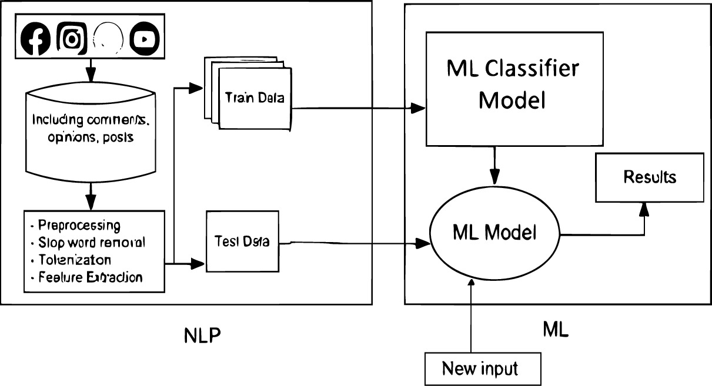

<div align="center">
  <h1>Cyberbullying Detection</h1>
  <p>A Comparative Study of Classification Algorithms</p>
  
</div>

---

## Overview

Welcome to the Cyberbullying Detection project! This repository contains code and resources for a comprehensive study of classification algorithms used in the context of cyberbullying detection. We explore various machine learning and deep learning techniques to identify cyberbullying in text data.



## Dataset

The `cyberbullying_tweets.csv` dataset used in this study on cyberbullying detection is sourced from Kaggle and comprises a total of 47,692 tweets. The dataset consists of two primary columns:

- **Tweet Text:** Contains the actual text of the tweet.
- **Cyberbullying Type:** Indicates the type of cyberbullying present in the tweet.

## Code Notebooks

Explore our Jupyter Notebook files:

- [`ML_Models.ipynb`](ML_Models.ipynb): Machine learning models for cyberbullying detection.
- [`DL_Stemming.ipynb`](DL_Stemming.ipynb): Deep learning approach using stemming for text preprocessing.
- [`DL_Lemmatization.ipynb`](DL_Lemmatization.ipynb): Deep learning approach using lemmatization for text preprocessing.

## Plots

The "Plots" folder contains insightful visualizations related to BERT model tuning:


## Usage

 **Clone the Repository:**

   ```sh
   git clone [https://github.com/your-username/cyberbullying-detection.git]
